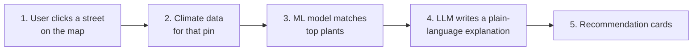

# 🌱 Re:Sprout

**Click a street. Get the plant that belongs there.**

Re:Sprout pairs climate data with a plant-matching model to recommend the
best trees and plants for a specific street — then uses an LLM to explain the
pick in plain language.

---

## How it works

| Step | What happens | Owner |
|---|---|---|
| 1. Pin a street | User clicks a street on the map; app captures its coordinates.
| 2. Get climate data | A climate data API returns surface temperature and conditions for that pin.
| 3. Match plants | A Decision Tree / Random Forest scores plants against local conditions and returns the top picks.
| 4. Explain it | An LLM turns raw scores into a human-readable reason.
| 5. Show the impact | Recommendation cards.

Behind every step: the **Backend & Cloud Architect** routes requests between
the website, the ML script, and the database, and keeps API keys server-side.

---

## Tech stack

- **Climate data:** a climate data API for surface temperature and conditions
- **Mapping:** an interactive mapping library
- **ML:** Python-based machine learning (Decision Trees / Random Forests)
- **Plant dataset:** a public plant database
- **Backend:** a hosted database + serverless functions
- **AI text:** an LLM API

---

